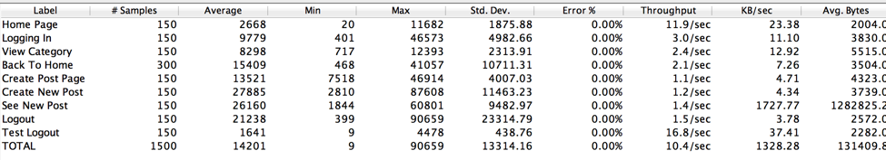

##Deployment onto Digital Ocean

This project is currently hosted on a Digital Ocean droplet at http://162.243.219.190:8000

Deployment was pretty straightforward and required creating a docker droplet on an ubuntu image, installing docker-compose onto the image, and cloning our github repo onto the image. There were some changes necessary for the docker yaml file, and those are reflected in our latests version on github. Two containers were then created on the droplet, web and mysql (as done in project 1), and then docker-compose up was executed which sucessfully deployed our the project onto Digital Ocean.

##Performance Testing with JMeter

I tested a sequence of actions on our website through our local running of the application and through Digital Ocean. The actions involved, in sequence, logging in, viewing a category, going back to the home page, creating a new post, looking at the new post, and logging out. I tested various number of users on the application (results below). In order to confirm that the proper web page was visited, I created a text response assertion that checked that a certain phrase was one the resulting page. Interestingly, the Digital Ocean hosting of the application had more errors than our local version. I had assumed that the Digital Ocean hosting would handle more users since cloud hosting is designed to gracefully handle an increase and decrease of users. Both applications reached problems with 200 users, but the Digital Ocean hosting had more errors at 150 users as well. The error that occurred was “Non HTTP response message: Operation timed out”. The Digital Ocean hosting has a higher average time (in milliseconds) in all cases tested. 

######Local 100 users

######Digital Ocean 100 users

######Local 150 users

######Digital Ocean 100 users

######Local 200 users

######Digital Ocean 200 users

######Local 250 users

######Digital Ocean 250 users

######Local 1000 users

##Unit Testing

I tested the experience layer. My first objective was to get as much code coverage as possible. I got it up to 98% with 99% of the views.py being covered. 

in order to run the tests 
* be inside teh exp_layer container
* pip install coverage
* coverage run --source='.' manage.py test
* To see coverage percentage
** coverage report -m
* To see detail of coverage line by line
** coverage html -d coverage

Outside of doing coverage testing, I made sure that given typical responses that the correct output was given, but also tested for edge cases to see if abnormal cases returned the correct result
